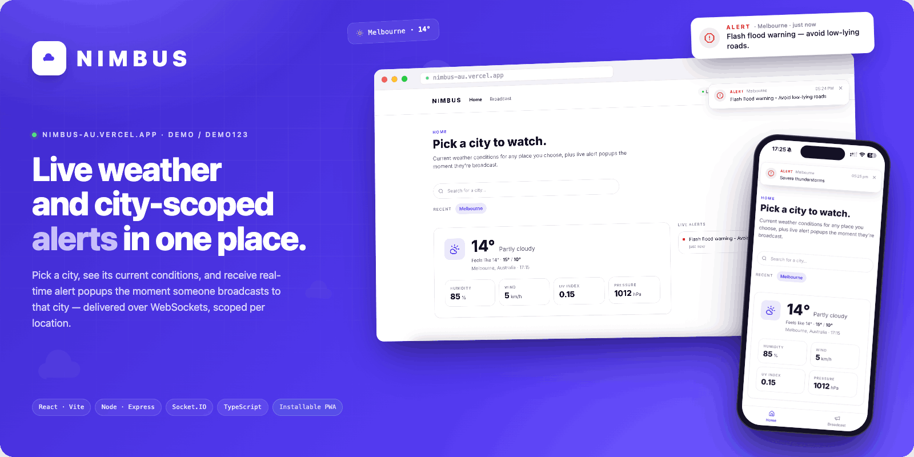
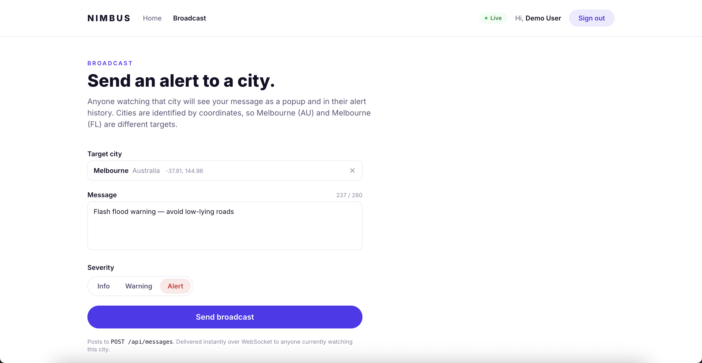
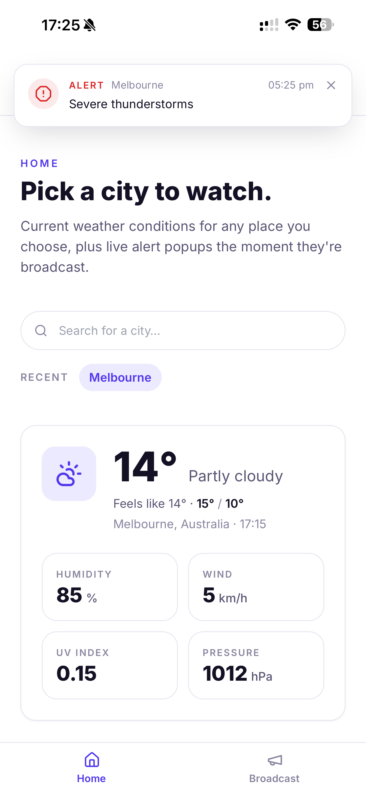

# Nimbus



Live weather and city-scoped alerts in one place. Pick a city, see its current
conditions, and receive real-time alert popups the moment someone broadcasts to
that city — delivered over WebSockets, scoped per location.

**Live demo:** https://nimbus-au.vercel.app · **Demo logins:** `admin` / `admin123` (full access) · `viewer` / `viewer123` (view-only)

> The demo runs on free tiers (Vercel + Render). The backend is kept warm with
> an uptime ping, so it should respond instantly; if it has been idle, the very
> first request may take ~30s to wake.

---

## What it does

Three core features, plus five extras built around them.

### Required

| # | Feature | How it works |
|---|---------|--------------|
| 1 | **Login** with username & password | Short-lived JWT access tokens (HS256) + rotating, DB-backed refresh tokens; bcrypt credentials; role-based access (admin/viewer); self-service register + password reset. One token guards both REST routes and the WebSocket handshake |
| 2 | **Pick a city, see current weather** | City search via Open-Meteo geocoding; current conditions + day high/low from the Open-Meteo forecast API |
| 3 | **Real-time popups via WebSockets** | Socket.IO broadcast scoped per city; `POST /api/messages` pushes an alert to everyone watching that city |

### Extras

1. **Progressive Web App** — installable on desktop and mobile from one codebase, with a bottom tab bar on mobile so it reads as a real app.
2. **Live demo deployment** — public, clickable URL (above).
3. **Docker** — `docker compose up` runs the whole stack locally.
4. **GitHub Actions CI** — lint, type-check, test and build on every push and PR.
5. **Per-city message history** — a browsable log of past alerts, not just transient popups.

Automated tests (289 across both packages), a documentation set (this README,
an architecture doc, nine ADRs, and an OpenAPI spec), and a clean
test-first commit history are included as standard.

### Live messages

A one-way **broadcast / pub-sub** system where **the city is the channel**:

- A **publisher** (the Broadcast page, or any `POST /api/messages` caller) sends a message and a target city.
- The **server** stores it and emits it over WebSocket to that city's room.
- **Subscribers** — users currently watching that city — receive it instantly as a popup.

An alert targeted at Melbourne reaches only the users watching Melbourne — notifications scoped to a location.



---

## Tech stack

**Backend** — Node.js · Express · TypeScript · Socket.IO · PostgreSQL · Prisma · Zod · jsonwebtoken · bcryptjs · helmet · cors · express-rate-limit · Vitest + supertest

**Frontend** — React · Vite · TypeScript · Tailwind CSS · React Router · socket.io-client · lucide-react · vite-plugin-pwa · Vitest + Testing Library

**Weather** — [Open-Meteo](https://open-meteo.com) (no API key required)

State lives in **PostgreSQL via Prisma** — users, per-city message history, and
the refresh / password-reset token tables — behind a thin repository layer. The
weather forecast cache stays in-memory with a short TTL (transient, per-instance).

---

## Architecture at a glance

A single-page React client talks to a Node API over two channels: REST for
request/response, and a WebSocket for server-pushed alerts.

```
        ┌──────────────────────────┐
        │        Browser           │
        │   React + Vite (PWA)     │
        └─────┬───────────────┬────┘
              │ REST (HTTPS)  │ WebSocket
              ▼               ▼
        ┌──────────────────────────┐
        │      Express API          │
        │   Node + TypeScript       │
        │   + Socket.IO (rooms)     │
        │   (weather cache: in-mem) │
        └────┬─────────────────┬───┘
             │ Prisma          │ HTTPS
             ▼                 ▼
  ┌────────────────────┐  ┌──────────────────────────┐
  │     PostgreSQL     │  │   Open-Meteo public API   │
  │ users · messages · │  │   geocoding + forecast    │
  │ refresh/reset tokens│  └──────────────────────────┘
  └────────────────────┘
```

Each city is a Socket.IO **room** keyed by its coordinates
(`city:<lat>|<lon>`), so two cities that share a name (Melbourne, AU vs
Melbourne, FL) get distinct alert streams. Full details, request flows and the
module breakdown are in **[docs/ARCHITECTURE.md](docs/ARCHITECTURE.md)**.

---

## Getting started

Requires **Node 20** (see `.nvmrc`). Two ways to run it.

### Option A — Docker (whole stack, one command)

```bash
cp .env.example .env       # set JWT_SECRET and POSTGRES_PASSWORD first
docker compose up --build  # postgres → migrate → API (seeds admin/viewer) → frontend
```

- Frontend: http://localhost:8080
- Backend: http://localhost:4000

Compose runs the database migrations (a one-shot `migrate` service) before the
API starts, so a clean checkout comes up ready to use.

### Option B — Local dev servers

Start Postgres first (the compose service is simplest), then the two dev servers:

```bash
# Database — start just Postgres (set POSTGRES_PASSWORD in the root .env)
cp .env.example .env
docker compose up -d postgres

# Terminal 1 — backend
cd backend
cp .env.example .env   # set JWT_SECRET; match DATABASE_URL's password to POSTGRES_PASSWORD
npm install
npm run db:migrate     # apply the schema (first run only)
npm run dev            # http://localhost:4000 — seeds admin/viewer on boot

# Terminal 2 — frontend
cd frontend
cp .env.example .env
npm install
npm run dev            # http://localhost:5173
```

Then open the frontend and sign in with `admin` / `admin123` (or `viewer` / `viewer123`).

### Configuration

Backend (`backend/.env`):

| Variable | Default | Purpose |
|----------|---------|---------|
| `PORT` | `4000` | API port |
| `NODE_ENV` | `development` | Runtime mode |
| `JWT_SECRET` | dev placeholder | Access-token signing secret — **set in production** |
| `JWT_EXPIRES_IN` | `15m` | Access-token lifetime (refresh tokens keep the session alive) |
| `CORS_ORIGIN` | `http://localhost:5173` | Allowed frontend origin |
| `DATABASE_URL` | local Postgres | PostgreSQL connection string (Prisma) |

Frontend (`frontend/.env`):

| Variable | Default | Purpose |
|----------|---------|---------|
| `VITE_API_URL` | `http://localhost:4000` | REST API base URL |
| `VITE_SOCKET_URL` | `http://localhost:4000` | WebSocket server URL |

---

## Trying the live-messages feature

Sign in, pick a city on the Home page (e.g. Melbourne), then open the
**Broadcast** page in another tab (or hit the API directly) and send an alert to
that same city. The popup appears instantly on the Home tab and is added to the
per-city history.

From the command line:

```bash
# 1. Log in and capture a token
TOKEN=$(curl -s -X POST http://localhost:4000/api/auth/login \
  -H 'Content-Type: application/json' \
  -d '{"username":"admin","password":"admin123"}' | jq -r .accessToken)

# 2. Broadcast an alert to Melbourne (AU)
curl -s -X POST http://localhost:4000/api/messages \
  -H 'Content-Type: application/json' \
  -H "Authorization: Bearer $TOKEN" \
  -d '{"city":"Melbourne","latitude":-37.81,"longitude":144.96,
       "message":"Flash flood warning — avoid low-lying roads.","severity":"alert"}'
```

Anyone watching Melbourne at those coordinates sees the popup the moment it's sent.

---

## API reference

Base URL: `http://localhost:4000`. All responses are JSON. The full contract,
including request/response schemas, is in **[docs/openapi.yaml](docs/openapi.yaml)**.

| Method | Path | Auth | Notes |
|--------|------|------|-------|
| GET | `/api/health` | – | Liveness probe |
| POST | `/api/auth/register` | – | `{ username, password, displayName }` → `{ user }` |
| POST | `/api/auth/login` | – | `{ username, password }` → `{ accessToken, refreshToken, user }` |
| POST | `/api/auth/refresh` | – | `{ refreshToken }` → fresh `{ accessToken, refreshToken, user }` (rotation) |
| POST | `/api/auth/logout` | – | `{ refreshToken }` → revokes it (idempotent) |
| POST | `/api/auth/password-reset/request` | – | `{ username }` → single-use reset token |
| POST | `/api/auth/password-reset/confirm` | – | `{ token, password }` → resets the password |
| GET | `/api/auth/me` | Bearer | Current user (incl. `role`) |
| GET | `/api/weather/cities?q=` | Bearer | City search (≥ 2 chars) |
| GET | `/api/weather?lat&lon&name[&country]` | Bearer | Current weather |
| POST | `/api/messages` | Bearer + admin | `{ city, latitude, longitude, message, severity? }` |
| GET | `/api/messages?latitude&longitude` | Bearer | Per-city history |

**Socket.IO** (namespace `/`, handshake `auth: { token }`):

| Event | Direction | Payload |
|-------|-----------|---------|
| `join-city` | client → server | `{ latitude, longitude, name? }` |
| `leave-city` | client → server | — |
| `live-message` | server → client | `LiveMessage` |

---

## Running the tests

```bash
# Backend (Vitest + supertest) — 159 tests (needs Postgres: `docker compose up -d postgres`)
cd backend && npm test

# Frontend (Vitest + Testing Library) — 130 tests
cd frontend && npm test
```

Both packages also expose `npm run lint`, `npm run typecheck`, and `npm run build`
— the same gates CI runs on every push.

---

## Installable PWA

Nimbus installs to desktop or mobile from the browser. The app shell is
precached so it cold-starts instantly; live data (weather + alerts) always hits
the network — stale safety information would be worse than none. On mobile it
uses a bottom tab bar and full-width layout to feel like a native app.



---

## Design decisions & trade-offs

The reasoning behind the significant choices is recorded as Architecture
Decision Records in **[docs/adr/](docs/adr/)**:

- **[0001](docs/adr/0001-socketio-over-raw-ws.md)** — Socket.IO over raw `ws` (rooms, reconnection, shared auth with REST).
- **[0002](docs/adr/0002-in-memory-storage.md)** — In-memory storage *(superseded by 0006)*.
- **[0003](docs/adr/0003-jwt-authentication.md)** — JWT auth (stateless; one token for REST + WebSocket).
- **[0004](docs/adr/0004-open-meteo-weather-api.md)** — Open-Meteo (no API key; 8s timeout; transient-failure retry).
- **[0005](docs/adr/0005-pwa-app-shell-caching.md)** — PWA app-shell caching (precache the shell, never the data).
- **[0006](docs/adr/0006-postgres-prisma.md)** — PostgreSQL + Prisma (persistence behind a repository layer).
- **[0007](docs/adr/0007-refresh-token-rotation.md)** — Refresh-token rotation (short access tokens + rotating, revocable refresh tokens).
- **[0008](docs/adr/0008-role-in-access-token.md)** — Role in the access token (in-memory authorization, no per-request DB hit).
- **[0009](docs/adr/0009-combobox-headless-ui.md)** — Headless UI combobox (accessible, consistent city search).

A few decisions worth surfacing here:

- **bcryptjs over native bcrypt** — pure JS, no native build step, Dockerises cleanly. ~30% slower at cost 10, irrelevant for a demo.
- **Coordinate-keyed city rooms** — the alert layer is keyed by `(lat, lon)`, not name, so same-named cities don't share a stream (see ADR 0001).
- **Resilience to a flaky free-tier upstream** — the backend times out Open-Meteo at 8s and retries transient failures with backoff; the frontend cancels superseded searches and applies a 15s client timeout. Cold-start blips are handled rather than surfaced.

---

## Known limitations & future work

- **Access-token staleness window** — a role change takes effect on the user's next access token (≤15 min) unless their refresh tokens are revoked, which forces an immediate re-login (see ADR 0008). Acceptable here; instant cross-service revocation would want RS256 + JWKS.
- **Weather cache is per-instance** — the short-TTL forecast cache is in-memory, so it isn't shared across backend instances. Fine single-instance; Redis is the multi-instance answer.
- **Free-tier cold start** — Render sleeps after 15 min idle. Mitigated by an uptime ping; the first cold request can still take ~30s.
- **Web Push notifications** — out of scope here; the in-app WebSocket popups satisfy the brief. Web Push (alerts when the tab is closed) is the natural next step.

---

## Project structure

```
Nimbus/
├── backend/            # Express + Socket.IO API (TypeScript)
│   ├── prisma/         # schema + migrations
│   └── src/
│       ├── auth/         # JWT + refresh service, requireAuth/requireRole, repos, routes
│       ├── weather/      # Open-Meteo proxy + WMO mapping + cache
│       ├── messages/     # Zod schemas, repo, routes
│       ├── middleware/   # request validation, request context
│       ├── realtime/     # Socket.IO city rooms
│       └── tests/        # Vitest + supertest
├── frontend/           # React + Vite PWA
│   └── src/
│       ├── auth/         # AuthContext, ProtectedRoute, useAuth
│       ├── socket/       # LiveMessagesProvider + useCityMessages
│       ├── components/   # AppShell, CitySearch, WeatherCard, Toast, …
│       ├── pages/        # Login, Register, Reset, Home, Broadcast
│       └── tests/        # Vitest + Testing Library
├── docs/               # ARCHITECTURE, ADRs, OpenAPI, screenshots
├── docker-compose.yml
└── .github/workflows/  # CI
```
